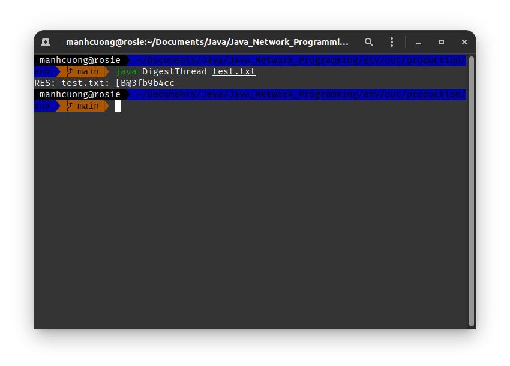
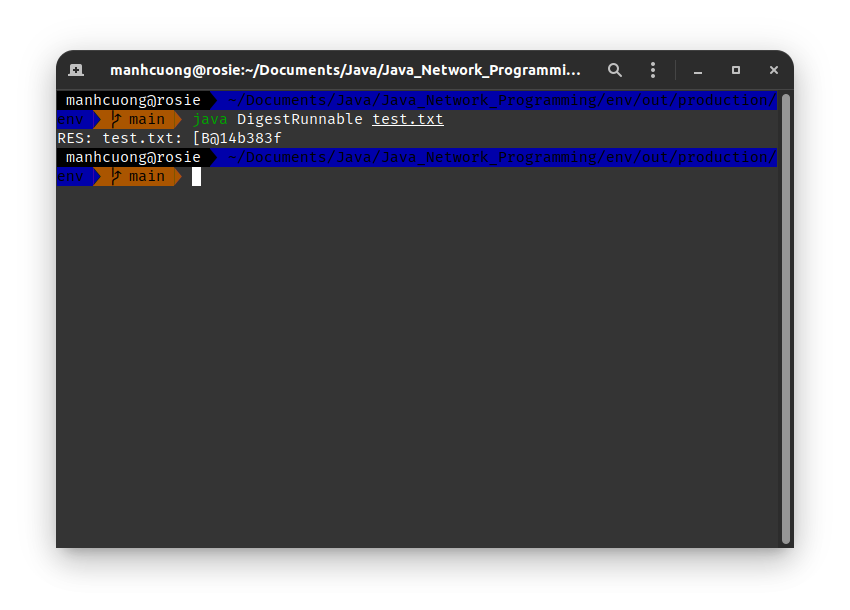

# 1. Running Threads
## 1.1. Subclassing Thread
###### DigestThread.java _[source code](DigestThread.java)_
```java
import java.io.*;
import java.security.*;

public class DigestThread extends Thread {
    private String filename;

    public DigestThread(String fn) {
        filename = fn;
    }

    public void run() {
        try {
            FileInputStream fis = new FileInputStream(filename);
            MessageDigest sha = MessageDigest.getInstance("SHA-256");
            DigestInputStream dis = new DigestInputStream(fis, sha);

            while (dis.read() != -1);
            byte[] digest = sha.digest();

            StringBuilder res = new StringBuilder(filename);
            res.append(": ");
            res.append(digest);

            System.out.println("RES: " + res);
        } catch (Exception err) {
            System.err.println(err);
        }
    }

    public static void main(String[] args) {
        for (String fn: args) {
            Thread thread = new DigestThread(fn);
            thread.start();
        }
    }
}
```


## 1.2. Implementing the Runnable Interface
###### DigestRunnable.java _[source code](DigestRunnable.java)_
```java
import java.io.*;
import java.security.*;

public class DigestRunnable implements Runnable {
    private String filename;

    public DigestRunnable(String fn) {
        filename = fn;
    }

    public void run() {
        try {
            FileInputStream fis = new FileInputStream(filename);
            MessageDigest sha = MessageDigest.getInstance("SHA-256");
            DigestInputStream dis = new DigestInputStream(fis, sha);

            while (dis.read() != -1);
            byte[] digest = sha.digest();

            StringBuilder res = new StringBuilder(filename);
            res.append(": ");
            res.append(digest);

            System.out.println("RES: " + res);
        } catch (Exception err) {
            System.err.println(err);
        }
    }

    public static void main(String[] args) {
        for (String fn: args) {
            DigestRunnable dr = new DigestRunnable(fn);
            Thread thread = new Thread(dr);

            thread.start();
        }
    }
}
```


# 2. Returning Information from a Thread
