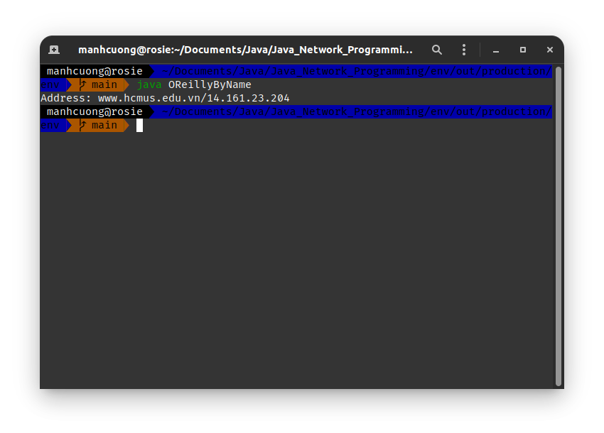
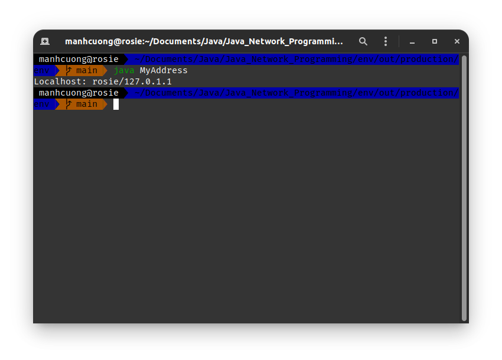
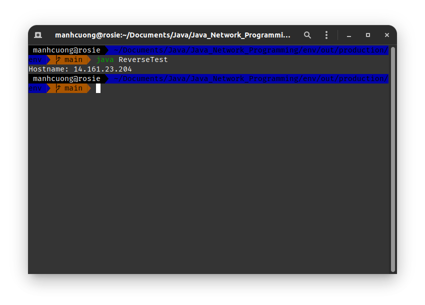
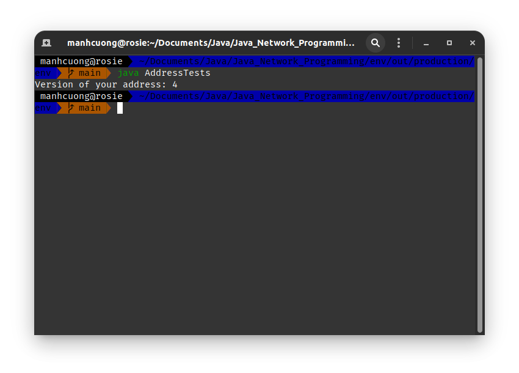

# 1. The InetAddress Class
## 1.1. Creating New InetAddress Objects
###### OReillyByName.java _[source code](OReillyByName.java)_
```java
import java.net.*;

public class OReillyByName {
    public static void main(String[] args) {
        try {
            InetAddress add = InetAddress.getByName("www.hcmus.edu.vn");
            System.out.println("Address: " + add);
        } catch (UnknownHostException err) {
            System.out.println("Could not find hcmus.edu.vn");
        }
    }
}
```


###### MyAddress.java _[source code](MyAddress.java)_
```java
import java.net.*;

public class MyAddress {
    public static void main(String[] args) {
        try {
            InetAddress add = InetAddress.getLocalHost();
            System.out.println("Localhost: " + add);
        } catch (UnknownHostException err) {
            System.out.println("Could not find your computer's address ");
        }
    }
}
```


## 1.2. Getter Methods
###### ReverseTest.java _[source code](ReverseTest.java)_
```java
import java.net.*;

public class ReverseTest {
    public static void main(String[] args) throws UnknownHostException {
        InetAddress add = InetAddress.getByName("14.161.23.204");
        System.out.println("Hostname: " + add.getCanonicalHostName());
    }
}
```


###### MyAddress1.java _[source code](MyAddress1.java)_
```java
import java.net.*;

public class MyAddress1 {
    public static void main(String[] args) {
        try {
            InetAddress add = InetAddress.getLocalHost();
            String dotted_quad = add.getHostAddress();

            System.out.println("My address is: " + dotted_quad);
        } catch (UnknownHostException err) {
            System.out.println("Sorry, I do not know my own address!");
        }
    }
}
```


###### AddressTests.java _[source code](AddressTests.java)_
```java
import java.net.*;

public class AddressTests {
    public static int getVersion(InetAddress ia) {
        byte[] add = ia.getAddress();

        return add.length == 4 ? 4 : add.length == 16 ? 6 : -1;
    }
    public static void main(String[] args) throws UnknownHostException {
        System.out.println("Version of your address: " + AddressTests.getVersion(InetAddress.getLocalHost()));
    }
}
```


## 1.3. Address Types
## 1.4. Testing Reachability
## 1.5. Object Methods

