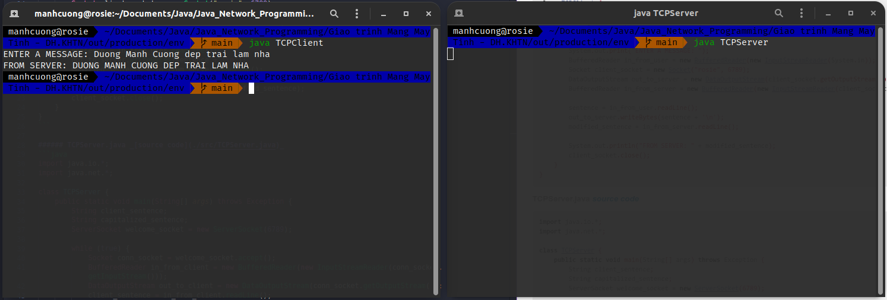

# 1. Demo Socket - Sách Giáo trình Mạng Máy Tính trang 166
###### TCPClient.java _[source code](./src/TCPClient.java)_
```java
import java.io.*;
import java.net.*;

class TCPClient {
    public static void main(String[] args) throws Exception {
        String sentence;
        String modified_sentence;

        System.out.print("ENTER A MESSAGE: ");
        BufferedReader in_from_user = new BufferedReader(new InputStreamReader(System.in));
        Socket client_socket = new Socket("rosie", 6789);
        DataOutputStream out_to_server = new DataOutputStream(client_socket.getOutputStream());
        BufferedReader in_from_server = new BufferedReader(new InputStreamReader(client_socket.getInputStream()));

        sentence = in_from_user.readLine();
        out_to_server.writeBytes(sentence + '\n');
        modified_sentence = in_from_server.readLine();

        System.out.println("FROM SERVER: " + modified_sentence);
        client_socket.close();
    }
}
```

###### TCPServer.java _[source code](./src/TCPServer.java)_
```java
import java.io.*;
import java.net.*;

class TCPServer {
    public static void main(String[] args) throws Exception {
        String client_sentence;
        String capitalized_sentence;
        ServerSocket welcome_socket = new ServerSocket(6789);

        while (true) {
            Socket conn_socket = welcome_socket.accept();
            BufferedReader in_from_client = new BufferedReader(new InputStreamReader(conn_socket.getInputStream()));
            DataOutputStream out_to_client = new DataOutputStream(conn_socket.getOutputStream());
            client_sentence = in_from_client.readLine();
            capitalized_sentence = client_sentence.toUpperCase() + '\n';
            out_to_client.writeBytes(capitalized_sentence);
        }
    }
}
```
